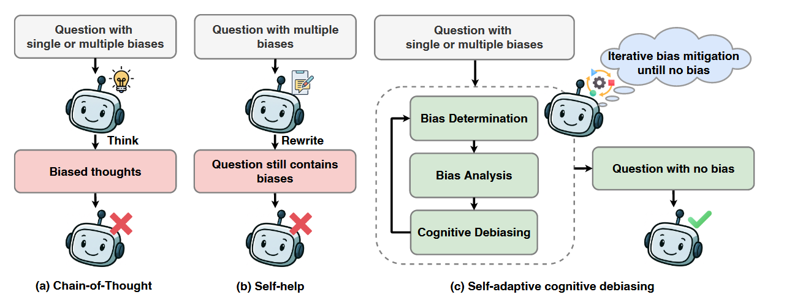

---

# 🧠 Self-Adaptive Cognitive Debiasing for Large Language Models in Decision-Making

> **LLMs are smart—but not rational.**  
> This repository implements **SACD**—a **self-adaptive cognitive debiasing framework** that helps LLMs make more **reliable, rational decisions** in high-stakes domains like **finance, healthcare, and law**.

[]()
[](https://creativecommons.org/licenses/by/4.0/)
[](https://arxiv.org/abs/2504.04141)

---

## 📌 Overview

Large Language Models (LLMs) are increasingly used as **decision-support assistants** in **critical domains**—yet they inherit **human-like cognitive biases** (e.g., anchoring, bandwagon, loss aversion), leading to **systematically flawed judgments**.

While existing debiasing methods assume **only one bias per prompt**, real-world decisions often involve **multiple simultaneous biases**. To address this, we propose:

### 🔁 **SACD** — *Self-Adaptive Cognitive Debiasing*

A **three-step iterative pipeline** inspired by human reasoning:
1. **Bias Determination** – Does the prompt contain bias?
2. **Bias Analysis** – What *type(s)* of bias are present?
3. **Cognitive Debiasing** – Rewrite the prompt to neutralize bias.

✅ Works across **open-weight** (e.g., LLaMA-3) and **closed-weight** (e.g., GPT-4o) models  
✅ Evaluated on **FOMC**, **PubMedQA**, and **LegalBench**  
✅ **Outperforms** CoT, Reflexion, Self-Help, Multi-Agent Debate & more

---

## ⚡ Quick Start

### 1. 🔑 Get API Keys

| Model Family | Model Names             | How to Get Key |
|--------------|-------------------------|----------------|
| **OpenAI**   | `gpt-3.5-turbo`, `gpt-4o` | [OpenAI Platform](https://platform.openai.com/) |
| **Meta/Groq**| `llama3-70b-instruct`   | [Groq Console](https://console.groq.com/) (free tier available!) |

### 2. 🛠️ Set Keys in Notebooks

At the top of any `.ipynb` file:

```python
# For OpenAI
client = OpenAI(api_key="sk-xxxxxxxxxxxxxxxxxxxxxxxx")

# For Groq (if using LLaMA)
groq_client = Groq(api_key="gsk_xxxxxxxxxxxxxxxxxxxxxxxx")
```

> ✅ **Tip**: Store keys in environment variables or `.env` for security!

---

## 🔄 Pipeline Overview



*SACD iteratively refines prompts by detecting, analyzing, and removing cognitive biases—until the prompt is deemed bias-free.*

---

## 🧪 Evaluation Methods

We compare SACD against **8 baselines** across **3 domains** and **4 bias settings**:

| Method                  | Notebook File               | Description |
|------------------------|-----------------------------|-------------|
| **Vanilla (Biased)**   | `Availableing-bias.ipynb`    | No debiasing (control) |
| **Chain-of-Thought**   | `Cot.ipynb`                  | Step-by-step reasoning |
| **Zero-Shot Debias**   | `Zero-shot.ipynb`            | Instruction-only mitigation |
| **Few-Shot Debias**    | `Few shot.ipynb`             | Example-based correction |
| **Multi-Agent Debate** | `Multi-agent debate.ipynb`   | Group deliberation |
| **Reflexion**          | `Reflexion.ipynb`            | Self-critique & refine |
| **Self-Help**          | `Self_help.ipynb`            | Single-pass prompt rewrite |
| ✨ **SACD (Ours)**     | `SACD.ipynb`                 | **Iterative, adaptive debiasing** |

---

## 🗂️ Dataset Preparation

1. **Download raw datasets** (FOMC, PubMedQA, LegalBench) from the [paper’s official resources].
2. Place them in a `data/` folder.
3. Run preprocessing:

```bash
data_process.ipynb
```

> 📁 Output: Clean `.jsonl` files ready for evaluation.

---

## 📊 Getting Results

After running any method notebook:
- Predictions are saved as `.jsonl` files.
- To **judge correctness** (e.g., compare against ground truth):

```bash
jupyter nbconvert --to notebook --execute judge_correct.ipynb
```

> 📈 Final metrics: **Bias Score** = `P(treatment chooses biased option) - P(control chooses it)`

Lower = better. **SACD consistently achieves the lowest scores** 🏆.

---

## 📁 File Structure Summary

```text
project/
├── data/                     # Raw & processed datasets (.jsonl)
├── pic/                      # Figures (e.g., pipeline.png)
├── data_process.ipynb        # Preprocess datasets
├── judge_correct.ipynb       # Evaluate answer correctness
├── Availableing-bias.ipynb   # Baseline (biased)
├── Cot.ipynb                 # Chain-of-Thought
├── Zero-shot.ipynb           # Zero-shot debiasing
├── Few shot.ipynb            # Few-shot debiasing
├── Multi-agent debate.ipynb  # Multi-agent debate
├── Self_help.ipynb           # Self-help method
├── Reflexion.ipynb           # Reflexion
└── SACD.ipynb                # 🌟 Our method!
```

---

## 📚 Citation

If you use **SACD** or this codebase in your research, please cite:

```bibtex
@article{lyu2025selfadaptive,
  title={Self-Adaptive Cognitive Debiasing for Large Language Models in Decision-Making},
  author={Lyu, Yougang and Ren, Shijie and Feng, Yue and Wang, Zihan and Chen, Zhumin and Ren, Zhaochun and de Rijke, Maarten},
  journal={ACM Transactions on Information Systems},
  year={2025},
  volume={1},
  number={1},
  pages={1--29},
  doi={https://doi.org/...}
}
```

Or use the arXiv version:

```bibtex
@misc{lyu2025selfadaptivecognitivedebiasinglarge,
  title={Self-Adaptive Cognitive Debiasing for Large Language Models in Decision-Making}, 
  author={Yougang Lyu and Shijie Ren and Yue Feng and Zihan Wang and Zhumin Chen and Zhaochun Ren and Maarten de Rijke},
  year={2025},
  eprint={2504.04141},
  archivePrefix={arXiv},
  primaryClass={cs.CL},
  url={https://arxiv.org/abs/2504.04141}
}
```

---

## 💬 Feedback & Contributions

- 🐞 Found a bug? Open an **Issue**!
- 🌟 Want to extend SACD? Submit a **Pull Request**!
- 📩 Questions? Contact: **us**

---

> 💡 *"The first step to rational AI is recognizing its irrationality."*  
> — The SACD Team

--- 

✅ Ready to **debias the future of LLM decision-making**? Start with `SACD.ipynb` today! 🚀
